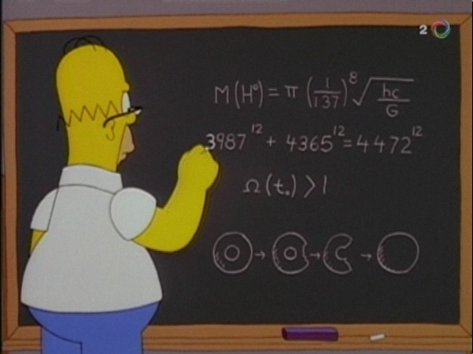

# Isolantes Topológicos - Python - Computação Quântica

## O que é um Isolante Topológico?

De uma maneira bem brusca e talvez errônea Isolantes topológicos são materiais  isolantes no volume da amostra(isso é dentro), mas que podem conduzir eletricidade na superfície. Você pode achar que isso não é tão interessante, mas espero te convencer do contrário, mas para isso falaremos um pouco sobre computação quântica.

### Por que ainda não tenho meu computador quântico?

Primeiramente, é importante ressaltar que seu computador já emprega fenômenos quânticos nos seu transistores(a maioria da tecnologia atual é baseada em quântica), mas quando é dito computação quântica nos referimos aquela computação envolvendo qubits e não bits. 

> Em princípio, um processador quântico de 30 qubits pode ser tão poderoso quanto um processador tradicional com 1 bilhão de transistores. Fonte: (http://goo.gl/B65nc6)

A computação quântica talvez seja o nosso Santo Grall, com ela poderíamos resolver problemas insolúveis atualmente, descobrir novos farmacos utilizando algoritmos ou desencadear uma crise econômica.

Raro a excesso dos computadores D-Wave a computação quântica ainda está longe de ser empregada, isso se deve por que os qubits são muito sensíveis as condições do ambiente, de modo que pequenas pertubações ou temperaturas muito acima do zero absoluto os desfazem. Portanto, antes de tentar computar com qubits talvez seja mais interessantes descobrir como protege-los, e é ai que os isolantes topológicos entram em cena.

### Proteção por topologia

Para um topólogo(matemático que se dedica ao estudo de topologia), o código abaixo faz todo sentido
```javascript
const surface ='rosquinha';

if(surface=='rosquinha'){
	return 'caneca';
}
```
Aqui está a prova.


A caneca pode ser transformada em uma rosquinha sem realizar nenhum corte ou colagem, isso é, a transformação é suave. Então a caneca é equivalente a rosquinha, e vice-versa. Mas uma bola não é equivalente há uma rosquinha, pois precisaríamos comer a rosquinha(como foi explanado por Homer Simpson).




O ato de ‘comer’ parte da rosquinha pode ser entendido como uma pertubação mais forte do ambiente, pois apenas mudanças de temperatura e lambidas não poderem alterar a superfície da rosquinha.


No inicio do texto eu disse que a  superfície do Isolante topológico é condutora, mas vai além disso. Os  estados condutores são protegidos por topologia, isso é,  a  maneira como os elétrons se distribuem no material ocorre de tal maneira que eles possuem uma topologia diferente. De modo que podemos “construir” qubits com esses isolantes, e tais qubits tornam-se mais “resistentes” a pertubação do meio, pois são protegidos pela sua topologia.


